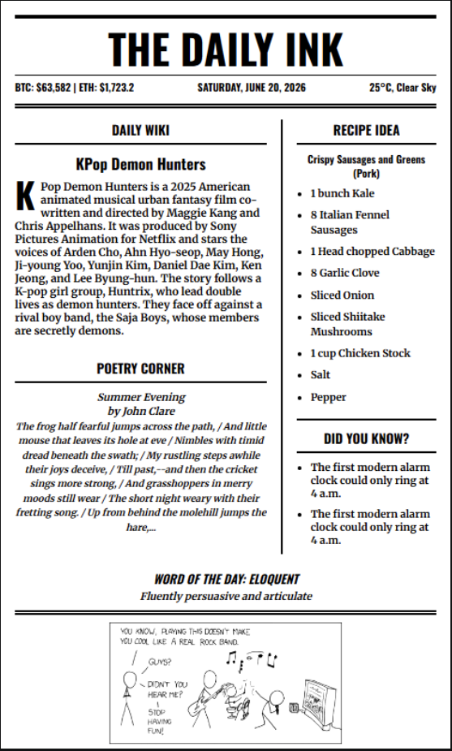
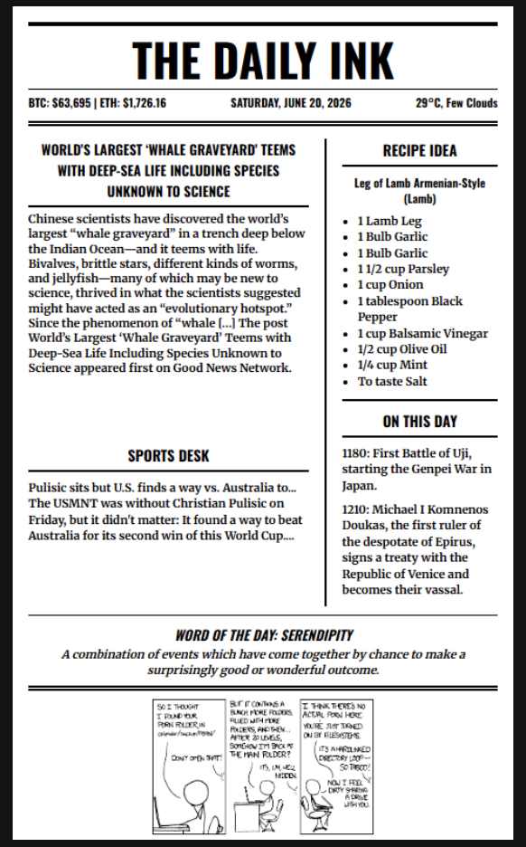
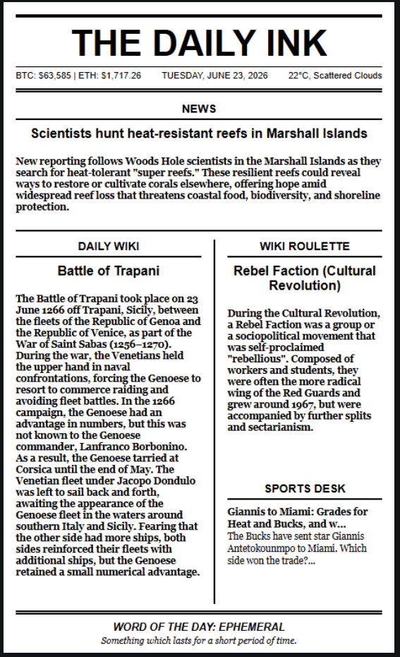

# The Daily Ink

<table>
  <tr>
    <td>
      
    </td>
    <td>
      
    </td>
  </tr>
</table>

A minimalist, fully automated digital newspaper designed for E-Ink displays. It fetches daily knowledge, news, weather, and a comic strip, rendering them into a clean, pixel-perfect, vintage newspaper layout.

With its cloud-rendered architecture, all heavy processing is handled by GitHub Actions. This allows the display hardware to act as a highly efficient, lightweight client that simply wakes up, downloads the daily image, and updates the screen.

---

## Hardware Used

To replicate the exact physical build of this project, you will need:

- **Raspberry Pi Zero W** (or Pi Zero 2 W) with headers soldered.
- **Pimoroni Inky Impression 7.3"** (7-colour e-paper display).
- A MicroSD card and a 5V power supply.

---

## How to "Subscribe" (Make it your own!)

You don't need a server to run this. You can "subscribe" to your own personalized daily newspaper by forking this repository and letting GitHub Actions do the heavy lifting for free.

**1. Fork the Repository:**
Click the **Fork** button at the top right of this repository to copy it to your own GitHub account.

**2. Configure Your Location & APIs:**
Go to your forked repository's **Settings** -> **Secrets and variables** -> **Actions**.

- **Secrets Tab:** Add a new secret named `OPENWEATHER_API_KEY` and paste your free OpenWeatherMap API key.
- **Variables Tab:** Add a new variable named `WEATHER_CITY` and type your city (e.g., `Bregenz, AT` - _do not use quotes_).

**3. Enable GitHub Actions:**
Go to the **Actions** tab in your repository and click **"I understand my workflows, go ahead and enable them."** The Action will automatically generate a fresh `newspaper.png` every day at 03:00 UTC (5:00 AM local summer time) and commit it to your `main` branch.

**4. Update the Client Link:**
In your `pi_client/update_display.py` file, change the `IMAGE_URL` to match your new GitHub username:
`https://raw.githubusercontent.com/YOUR_USERNAME/the-daily-ink/main/newspaper.png`

---

## Raspberry Pi Zero Setup (Client)

The Pi acts as a terminal. It wakes up, grabs the generated image from GitHub, pushes it to the Inky display, and goes back to sleep.

**1. Install the Pimoroni Software:**
Before running the client code, you must install the official Pimoroni drivers and enable the SPI interface. Follow the official guide here:
[Getting Started with Inky Impression - Installing the Software](https://learn.pimoroni.com/article/getting-started-with-inky-impression#installing-the-software)

**2. Setup the Client Directory:**
SSH into your Raspberry Pi and copy the `pi_client` folder from this repository.

```bash
# Navigate to the client folder
cd pi_client

# The Pimoroni installer creates a virtual environment called 'pimoroni'.
# Ensure your dependencies are installed there:
/home/admin/.virtualenvs/pimoroni/bin/pip install -r requirements-pi.txt
```

**3. Automate the Morning Delivery (Cronjob):**
Set the Pi to automatically update shortly after GitHub finishes generating the image.

```bash
crontab -e
```

Add this line to run the update every morning at 5:15 AM:

```bash
15 5 * * * /home/admin/.virtualenvs/pimoroni/bin/python /home/admin/pi_client/update_display.py >> /home/admin/pi_client/cron.log 2>&1
```

---

## Local Testing & Modification

If you want to modify the Python generation logic or tweak the HTML layout on your local PC:

**1. Clone your fork and install dependencies:**

```bash
git clone [https://github.com/YOUR_USERNAME/the-daily-ink.git](https://github.com/YOUR_USERNAME/the-daily-ink.git)
cd the-daily-ink

python -m venv venv
# On Windows: .\venv\Scripts\activate
# On Mac/Linux: source venv/bin/activate

pip install -r requirements.txt
```

**2. Set local environment variables:** Create a `.env` file in the root directory:

```text
OPENWEATHER_API_KEY=your_api_key_here
WEATHER_CITY=Bregenz, AT
```

**3. Test the generator:**

```bash
python generate.py
```

---

## Customizing the Layout & Adding Modules

The Daily Ink uses a **Modular Component System**. You don't need to touch complex layout code; you simply move "Lego-style" blocks around. **Python supplies the data, and HTML organizes the space.**

Layout Examples:
| Banner Layout | Feature Layout |
| :---: | :---: |
|  |  |

### 1. Moving Existing Modules

To rearrange the newspaper, open `templates/layout.html`.
The middle of the paper is divided into two buckets: `<div class="col-left">` and `<div class="col-right">`.

You will see simple placeholders like `{wiki_block}` or `{sports_block}`. To move a module, simply cut the placeholder from one column and paste it into the other.
_Note: If you want a module to float to the very bottom of its column, wrap it in an anchor div: `<div class="anchor-bottom">{module_block}</div>`._

### 2. Adding a Completely New Module

Adding a new data feed is a three-step process:

**Step 1: Get the data (Python)**
Create a new function (e.g., in `modules/culture.py`) to fetch your data. In `generate.py`, call your function and load its corresponding HTML template:

```python
# In generate.py
new_data = fetch_new_module()
new_block = load_module_html("filename_of_module").format(variable_name=new_data)
```

**Step 2: Map the variable (Python)**
Add your new block to the `replacements` dictionary in `generate.py`:

```python
replacements = {
    # ... existing variables ...
    "{new_module_block}": new_block
}
```

**Step 3: Drop it into the layout (HTML)**
Create a new file in `templates/modules/new_module.html`, then add the placeholder to `templates/layout.html`:

```html
<div class="col-left">{new_module_block}</div>
```

### 3. Handling Long Text Walls

If a module provides a massive wall of text, use the built-in text limiters in your HTML template file. Add `class="limit-text-short"` (max 8 lines) or `class="limit-text-long"` (max 14 lines) to the container div. It will automatically truncate the text with an elegant `...` if it overflows.

## Project Structure

```text
the-daily-ink/
├── modules/
│   ├── __init__.py
│   ├── weather.py         # OpenWeatherMap API
│   ├── news.py            # Wiki, Verge RSS, History API
│   └── culture.py         # Useless facts, Wordnik, Quotes, XKCD
├── pi_client/
│   ├── update_display.py    # Hardware deployment script
│   └── requirements-pi.txt  # Lightweight Pi dependencies
├── templates/
│   └── layout.html        # HTML/CSS structural template
├── generate.py            # Main cloud orchestration script
├── requirements.txt       # Cloud/Local Python dependencies
└── .github/workflows/
    └── main.yml           # GitHub Actions automation schedule
```

---

## Disclaimer & Copyright

This project acts purely as an aggregator for personal, non-commercial use.

- **XKCD Comics:** Comic strips are fetched from [xkcd.com](https://xkcd.com) and are licensed under the Creative Commons Attribution-NonCommercial 2.5 License.
- **News & APIs:** All news headlines, historical facts, and weather data belong to their respective creators and APIs (e.g., Wikipedia, The Verge, OpenWeatherMap, Wordnik, ZenQuotes, Muffinlabs History API).

Please ensure you comply with the terms of service of the respective APIs if you modify the fetch requests.
